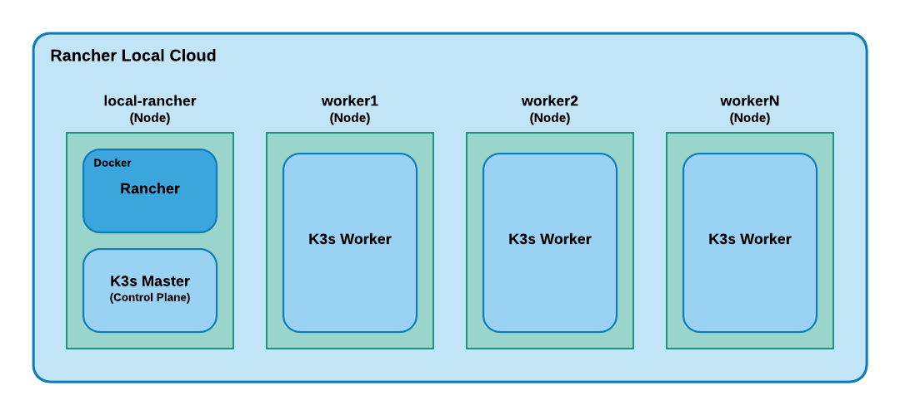

# Rancher Local Cloud

Spin up a local Kubernetes (K8s)cloud, orchestrated by Rancher, on your Mac or Windows machine. 

## Introduction

Rancher2 is a powerful and robust K8s orchestration tool.  However, to use it for local development on a Mac or Windows machine is not a trivial task as it does not work with Docker for Desktop. Rancher requires an IP Address that is accessible by its agents.  Docker for Desktop does not support this as it does some network "magic" and ties its underlying VM to the localhost of the host.

This repository contains bash scripts to deploy a local kubernetes cloud based on [Rancher v2](https://rancher.com/docs/rancher/v2.x/en/), [K3s](https://rancher.com/docs/k3s/latest/en/), and [Multipass VMs](https://multipass.run/).  It's a great way to get started with Rancher2.

## Prerequisites

* Sizable machine with adequate resources to run at least 3 VMs
* MacOS (Windows support is in progress)
* [Multipass](https://multipass.run/)
* [Kubectl](https://kubernetes.io/docs/tasks/tools/install-kubectl/)
* [JQ - command line JSON processor](https://stedolan.github.io/jq/)
* Personal RSA key
  * Scripts copy your public SSH2 RSA keys to Ubuntu VMs to allow simple SSH into the VMs from your machine
  * Suggest to use a key that does not have a password so that you do not get a password prompt when using docker client (see Step 8)

## Test Environment

These scripts were tested on:

* macOS Catalina MacBook Pro with 8-Core Intel Core i9 and 32 GB RAM
* Windows 10 Enterprise (Version	10.0.17763 Build 17763) with 6-Core Intel i7 and 32 GB RAM
  * Scripts were run using GNU bash version 4.4.23(1)-release.  __GNU Bash is run with administrator rights__

## Known Issues

### Proxy

On Windows, there are two issues relating to the proxy:

1. Multipass requires that proxy variables HTTP_PROXY and HTTPS_PROXY be set system wide (i.e. system environment variable)
    > To fix, please add/set HTTP_PROXY and HTTPS_PROXY to your System Environment.  Also please set NO_PROXY to "127.0.0.1,localhost,.nycnet". 
1. Kubectl and curl do not honor NO_PROXY environment variable
    > To fix, use __./kubectl.sh__ instead of kubectl.  It's a wrapper for kubectl that simply removes any proxy settings and then calls kubectl.

### Other

1. The certification creation scripts do not ◊work with Windows.  Use another means to create your own certificate bundle

## Usage Instructions

### Step 0 - Provide Scripts with Execution Permissions

From the root directory, run:

    chmod +x ./**/*.sh

### Step 1 - Create Self-signed Certificate for Rancher

For security purpose, Rancher requires the use of SSL.  With a default install, Rancher will create its own self-signed certificate.  However, this method is a little annoying in that with every installation of Rancher, you will be forced to accept the certificate within your browser.  You'll also need to install it on your machine for secure automation via the Rancher API.

To simply the creation and destruction of your Local Rancher Cloud, please use pre-generated certificates found at __[ROOT]/certs/rancher__ or create your own certificates by navigating to __[ROOT]/certs/create-scripts__ and executing:

    ./create-cert-bundle.sh

> Custom certs will be used if they exist.  Otherwise, the pre-generated certs will be used.

The cert generation scripts use hard-coded settings that set the domain set to "local-rancher".

Once the script completes, the generated certificates will be found in _[ROOT]/certs/custom_. Complete this process by adding the certs to your OS's keychain as trusted certificates.

> For Mac, add cacerts.pem and cert.pem to your keychain (make sure to trust root); for Windows, run the following commands:
>
> * certutil -addstore -enterprise -f "Root" cacerts.pem 
> * certutil -addstore -enterprise -f "CA" intcerts.pem 

### Step 2 - Create cloud.properties

Navigate back to the [ROOT] folder and copy _cloud.properties.sample_ to "cloud.properties".  Edit this file and set parameters appropriately.

NO_PROXY must contain "localhost,127.0.0.1,0.0.0,10.0.0.0/8" at a minimum.  Please add addresses for your particular envionment.  For Mac/xHyve, it is usually 192.168.64.0/24; for Windows/Hyper-V is is 172.17.0.0/16 or 192.168.0.0/16.

> Note: worker nodes should have at least 8GB if you plan on installing Istio and Rancher Monitoring.

### Step 3 - Spin up the Cloud

To spin up the cloud, simply run:

    ./rancher-cloud.sh -c

When script completes, navigate to <https://local-rancher:9443>. The K3s cluster may take a few minutes to fully register in Rancher.

> Note: add '-p' to configure proxy (e.g ./rancher-cloud.sh -cp)

> Note: add '-i' to work with Istio (i.e. remove traefik ingress to address [port issue](https://github.com/rancher/k3d/issues/104))

### Step 4 - To List Cloud Nodes

To see the list of cloud nodes, or VMs that make up the cloud, run:

    ./rancher.sh -l

### Step 5 - Teardown the Cloud

To destroy the cloud, run:

    ./rancher-cloud.sh -d

### Step 6 - Help

To view all execute options, please run:

    ./rancher.sh -h or ./rancher.sh

### Step 7 - Interact with K3s Cluster using Kubectl

In order to interact with the K3s cluster via a shell, the _KUBECONFIG_ environment variable needs to set.  For convenience, the _init-shell.sh_ has been provided within the _[ROOT]_ folder.  

Executing the following to properly configure your shell session for kubectl.

    source init-shell.sh, source [relative path]/init-shell.sh

### Step 8 - Interact with Docker on local-rancher

Executing the command in Step 6 also configures your Docker client to point to the Docker daemon on the local-rancher vm.

> Note: Docker client to daemon conenction is done via SSH using personal key used for node creation.

## Extension Points

There are three extension points within the _rancher-cloud.sh_ script were users can add additional scripts to run. They are:

* pre-scripts
* os-scripts
* cluster-scripts_

_pre-scripts_ are run before VMs are built; _os-scripts_ run after the OS is installed and configured for Rancher; and _cluster-scripts_ are run after the k3s cluster is created, but prior to it being imported by Rancher.

Extension scripts are located in _[ROOT]/scripts/[EXTENSION_TYPE]_.  To add an extension, navigate to desired extension type (pre-, os-, or cluster-), add desired bash script, and alter _execute.sh_ to invoke the added script.  See the _execute.sh.sample_ file for examples.

> Note: use pre-scripts to invoke scripts that set up your environment.  For example, if you are running a MAC and are connected to a VPN, invoke _xhyve-vpn-fix.sh_ to fix routing so it works with the xhyve hypervisor.

> Note: a good use of cluster-scripts is to add private registries to the K3s cluster.

### Included Extensions

### MetalLB

> Not supported on Windows/Hyper-V

Extension point: Cluster Script

A load-balancer implementation for bare metal Kubernetes clusters, using standard routing protocols.  It is set up in layer 2 mode.

<https://metallb.universe.tf/>

### Xhvye VPN Fix

Extension point: Pre-script

A bash script to fix NAT rules when a VPN is run.  VPN connection should be established prior to brining up the local cloud.  If VPN connection is established after cloud is created, please run the script manually.

## Credits

* [Arash Kaffamanesh - K3S with MetalLB on Multipass VMs](https://blog.kubernauts.io/k3s-with-metallb-on-multipass-vms-ac2b37298589)
* [Mattia Peri - Kubernetes multi-node cluster with k3s and multipass](https://levelup.gitconnected.com/kubernetes-cluster-with-k3s-and-multipass-7532361affa3)
* [Sebastiaan van Steenis - GitHub Gists](https://gist.github.com/superseb)

## License

Copyright (c) 2020 nuArch LLC

Licensed under the Apache License, Version 2.0 (the "License"); you may not use this file except in compliance with the License. You may obtain a copy of the License at

<http://www.apache.org/licenses/LICENSE-2.0>

Unless required by applicable law or agreed to in writing, software distributed under the License is distributed on an "AS IS" BASIS, WITHOUT WARRANTIES OR CONDITIONS OF ANY KIND, either express or implied. See the License for the specific language governing permissions and limitations under the License.
